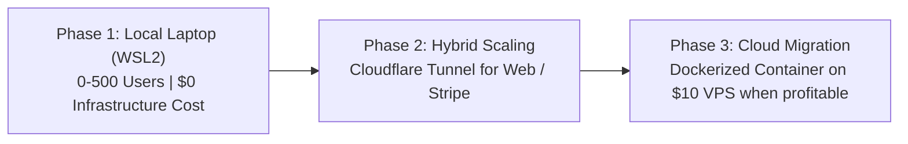

# Project Master Blueprint: The Modular Asset & SaaS Engine
**Codename:** *OmniForge Engine*  
**Core Ethos:** *Start Fast, Fail Fast, Iterate Relentlessly.*

---

## 1. Executive Summary & Vision

The **OmniForge Engine** is a decoupled, asynchronous software architecture designed to rapidly formulate, generate, and monetize digital assets and SaaS products with near-zero marginal cost. 

Instead of building isolated, one-off tools that require starting from scratch every time an idea strikes, OmniForge separates **Business Logic (Cartridges)** from **Delivery Systems (Channels)**, powered by a robust **Shared Media & Intelligence Kernel (Core)**.

```
┌────────────────────────────────────────────────────────────────────────┐
│                   DISTRIBUTION CHANNELS (Interchangeable)             │
│    Telegram Bot   │   WhatsApp Bot   │   Web App (PWA)  │  Podcast RSS │
└──────────────────────────────────┬─────────────────────────────────────┘
                                   │ Unified Request Protocol
┌──────────────────────────────────▼─────────────────────────────────────┐
│                      CORE ORCHESTRATION KERNEL                         │
│  Async Job Queue  │  9router/LLM  │  Edge-TTS  │  ffmpeg Media Mixer   │
└──────────────────────────────────┬─────────────────────────────────────┘
                                   │ Cartridge Interface
┌──────────────────────────────────▼─────────────────────────────────────┐
│                   PRODUCT FACTORIES (Plug-in Cartridges)               │
│  [Cartridge 1] Kids Screen-Free Bedtime Audio (Ages 2 & 8)             │
│  [Cartridge 2] Gamified RPG Habit & Routine Printables (PDF)           │
│  [Cartridge 3] Automated YouTube-to-Shorts Video Clipper (Existing)    │
│  [Cartridge N] Future Experiments (Trivia, Micro-Guides, Newsletters) │
└────────────────────────────────────────────────────────────────────────┘
```

---

## 2. Core Architecture: How It Works

### The 3-Tier Decoupled Architecture

#### Tier 1: Distribution Channels (The "Pipes")
Channels are purely communication interfaces. They receive requests from users and deliver generated assets back. The engine does not care where the request came from:
* **Telegram Bot:** Ideal for rapid developer testing, tech-savvy early adopters, and automated group broadcasts.
* **WhatsApp Automation (Meta Cloud API / Baileys bridge):** The highest-converting channel for parents in Indonesia, SE Asia, and Europe.
* **Mobile Web App (PWA):** Zero-friction public web interface (Next.js / Svelte / Streamlit) for global credit card billing without the 30% Apple App Store tax.
* **Private Podcast RSS Feed:** Direct delivery into Apple Podcasts, Spotify, and smart speakers (Alexa, Google Nest).

#### Tier 2: The Core Kernel (The "Brain & Hands")
Runs 24/7 as an asynchronous daemon on your idle Intel i5 6th Gen / 16GB RAM laptop inside WSL2:
1. **Router Client (`core/router.py`):** Interfaces with your existing 9router / OpenCode setup for rapid, cost-effective LLM routing.
2. **Voice Synthesizer (`core/voice.py`):** High-speed neural voice generation via `edge-tts`. Supports emotional tones, pacing modulation (`-10%` to `-15%` for sleep), and multi-lingual voice profiles.
3. **Media Mixer (`core/media.py`):** Headless `ffmpeg` processing. Implements **smart audio ducking** (mixing voiceover with ambient piano/lullaby beds) and video reframing (9:16 vertical clipping).
4. **Asset Compiler (`core/pdf.py`):** Programmatic PDF rendering for printable activities, routine trackers, and checklists using `ReportLab` or `WeasyPrint`.

#### Tier 3: Plug-and-Play Cartridges (The "Products")
Every new business experiment is contained in an isolated module adhering to an abstract contract:

```python
class BaseCartridge(ABC):
    @property
    @abstractmethod
    def name(self) -> str:
        """Unique cartridge identifier."""
        pass

    @abstractmethod
    async def generate(self, payload: dict) -> GenerationOutput:
        """
        Takes raw user input, executes domain logic, 
        and returns rendered artifacts (MP3, PDF, MP4).
        """
        pass
```

---

## 3. Target Markets & Problem-Solution Matrix

The engine is engineered to address two high-value, highly responsive target audiences:

### Market A: Parents of Young Children (Ages 2–8)
* **The Pain Points:**
  * **Screen-Time Guilt:** Parents are exhausted and rely on iPads/YouTube, but hate the resulting dopamine addiction, tantrums, and attention deficit.
  * **Bedtime Battles:** Children resist going to sleep; parents spend 45–60 minutes every night negotiating bedtime.
  * **Routine Resistance:** Nagging kids to brush teeth, do homework, or clean rooms leads to constant household friction.
* **The OmniForge Solution:**
  * **For 2-Year-Olds:** Calming, sensory-repetitive audio stories + tactile printable "Quiet Binders" (shape matching, visual morning/evening routine boards).
  * **For 8-Year-Olds:** Personalized hero audio adventures (child is the main character solving problems through kindness, courage, and patience) + Gamified "Hero Quest" habit trackers (earning XP for daily chores).

### Market B: Content Creators, Clippers & Agencies (B2B)
* **The Pain Points:**
  * Scrubbing through 2-hour podcasts manually takes hours of tedious editing.
  * Commercial tools (Opus Clip, Submagic) charge high recurring monthly subscriptions ($20–$50/mo).
* **The OmniForge Solution (Cartridge #3):**
  * Automated extraction of 3 viral vertical shorts from long YouTube videos with word-level synced captions delivered in minutes.

---

## 4. Monetization Blueprint: Maximizing Every Single Penny

The engine generates cash flow across **5 simultaneous revenue streams**:

| Stream | Product Model | Price Point | Expected Volume | Monthly Potential |
| :--- | :--- | :--- | :--- | :--- |
| **1. B2C Parenting Micro-SaaS** | WhatsApp / Telegram / PWA VIP membership (unlimited stories & quests) | **$4.99 – $8.99 / mo** | 50 – 200 parents | **$250 – $1,800 / mo** |
| **2. B2B Clipper SaaS** | License to the YouTube Clipping Cartridge (Desktop or Web) | **$19 / mo** or **$59 Lifetime** | 10 – 30 creators | **$190 – $1,770 / mo** |
| **3. Digital Asset Bundles** | Curated 30-day audio adventure albums + printable activity books (Etsy/Gumroad) | **$9.99 – $14.99 one-time** | 20 – 50 sales | **$200 – $750 / mo** |
| **4. Streaming Royalties** | Automated publishing of evergreen bedtime stories to Spotify / YouTube Kids | **$15 – $25 CPM** | 20k – 100k plays | **$300 – $2,500 / mo** |
| **5. Clipping Bounty Campaigns** | Running Cartridge #3 on active Whop / Content Rewards time-based bounties | **$1.00 – $2.50 / 1k views** | 1–3 winning clips | **$100 – $400 / mo** |

### Unit Economics & Profit Margins
* **Server Compute:** **$0** (Hosted locally on your idle i5 6th Gen / 16GB RAM laptop; electricity is ~$2/month).
* **Voice Generation:** **$0** (Edge-TTS is free and unmetered).
* **Media Processing:** **$0** (ffmpeg is open-source).
* **LLM Cost per Story / Clip:** **~$0.003** (3 tenths of a cent via 9router).
* **Net Profit Margin:** **~98%**.

---

## 5. Technical Feasibility & Scalability

### Why Your Hardware is Perfectly Sized:
* **Intel i5 6th Gen:** Easily handles 4 concurrent ffmpeg audio mixes per second.
* **16 GB RAM:** Linux / WSL2 + Python daemon + Telegram client consumes **~250 MB RAM**. Over 15 GB remains free.
* **Storage:** 500 GB SSD can store over 50,000 compressed MP3 bedtime stories and PDF printables.

### The Scaling Path:


---

## 6. Rapid-Iteration Execution Roadmap

Built to honor the principle: **Start fast, fail fast, repeat until we make it.**

```
┌────────────────────────────────────────────────────────────────────────┐
│ SPRINT 1 (Days 1–2): Core Kernel & First Bedtime Cartridge             │
│ • Build core directory structure & BaseCartridge interface             │
│ • Implement core/voice.py (Edge-TTS) & core/media.py (ffmpeg ducking)  │
│ • Implement cartridges/bedtime_story.py                                │
│ • Test locally: Render 1 story for your 2yo and 8yo tonight  [COMPLETED]│
├────────────────────────────────────────────────────────────────────────┤
│ SPRINT 2 (Days 3–4): First Distribution Channel (Telegram Bot)         │
│ • Implement core/bot.py with dynamic cartridge registration            │
│ • Connect /story command to smartphone                                 │
│ • Validate end-to-end user experience in your own household            │
├────────────────────────────────────────────────────────────────────────┤
│ SPRINT 3 (Days 5–6): Cartridge #2 (Printable Quest PDF) & Clipper Port │
│ • Port your existing YouTube clipper script into cartridges/clipper.py │
│ • Implement cartridges/daily_quest.py (ReportLab PDF generator)        │
│ • Test batch generation of 30-day audio/PDF bundles                    │
├────────────────────────────────────────────────────────────────────────┤
│ SPRINT 4 (Day 7+): Commercialization & Monetization Deployment         │
│ • Set up Gumroad/Payhip digital storefront for one-time bundles        │
│ • Add payment gateway trigger (Stripe / Telegram Stars / QRIS)         │
│ • Share first demo with 5 real parent testers                          │
└────────────────────────────────────────────────────────────────────────┘
```
