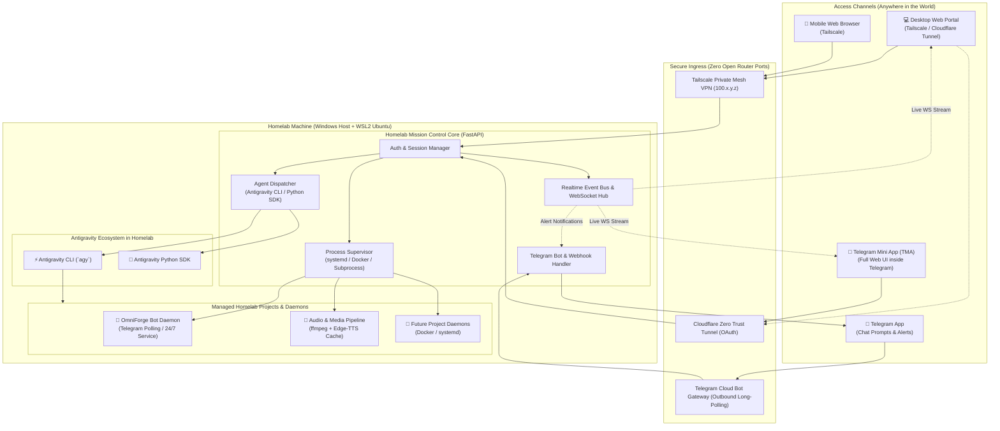

# Homelab Mission Control: Multi-Project Web & Telegram Portal Architecture

**Status:** Proposed Architecture  
**Author:** Pair Programming Team (Aufar & Antigravity)  
**Date:** September 2026  

---

## 1. Executive Summary

As development expands across multiple products, autonomous agents, and background daemons (OmniForge Telegram Bot, Bedtime Story, AutoForge, Morning Report, Clip Generator, and future micro-apps), we require a unified **Mission Control Portal**.

This portal solves three core operational needs:
1. **Live Observability**: Watch agents execute tasks, stream terminal output, and monitor service health in real time.
2. **Universal Access & Control**: Manage, restart, and deploy projects from anywhere (desktop browser or mobile phone) without opening insecure router ports.
3. **Omnipresent Prompting**: Dispatch prompts, review proposals, and approve agent actions whether sitting at a desk or walking outside.

We adopt a **Hybrid Architecture** combining a **FastAPI + WebSocket Web Dashboard** with a **Telegram Bot & Telegram Mini App (TMA)** backend.

---

## 2. System Architecture

---

## 3. The 3 Core Pillars

### Pillar A: The Web Dashboard (Mission Control)
- **Tech Stack**: FastAPI backend + Lightweight React / Vue / Vanilla SPA frontend.
- **Service Cards**:
  - Live status indicator (🟢 Running, 🟡 Starting, 🔴 Failed, ⏸️ Stopped).
  - CPU, RAM, GPU, and disk utilization metrics.
  - 1-click action buttons: `[ Restart ]`, `[ Stop ]`, `[ Pull & Rebuild ]`, `[ View Logs ]`.
- **Live Terminal & Agent Stream**:
  - High-density WebSocket terminal output with ANSI color support (`xterm.js`).
  - Agent thought stream: watch Antigravity think, plan, and execute tool calls in real time.
- **Artifact & Audio Gallery**:
  - Directly play back generated audio stories (`.mp3`), review transcripts, and inspect generated assets.

### Pillar B: Telegram Integration (The Pocket Controller)
- **Everywhere Access**: Zero VPN or port configuration required; works seamlessly over cellular networks.
- **Push Alerts**: Instant notifications for errors, build completions, or daily summaries.
- **Voice & Text Prompting**: Send a message or voice note from your phone to prompt the agent:
  - *"/status"* $\rightarrow$ Summary card of all running homelab services.
  - *"/restart omniforge"* $\rightarrow$ Restarts the Telegram bot daemon.
  - *"/prompt omni-forge: run test suite and send report"* $\rightarrow$ Dispatches task to `agy`.
- **Telegram Mini App (TMA)**:
  - Persistent menu button `[ 🌐 Mission Control ]` at the bottom of the chat.
  - Opens the full Web Dashboard directly inside Telegram as a native overlay sheet.

### Pillar C: Agent Dispatcher (`agy` & SDK)
- When a task is triggered from the Web Portal or Telegram:
  1. The Mission Control backend spawns `agy` or invokes the `google-antigravity` Python SDK targeting the requested project workspace (e.g. `dev/omni-forge`).
  2. The agent's reasoning deltas and tool execution outputs are piped into the WebSocket Event Bus.
  3. The web portal renders the live trace, while Telegram receives a high-level completion summary upon exit.

---

## 4. Security & Networking Blueprint

1. **Zero Public Port Forwarding**: The home router never exposes open ports to the internet.
2. **Access Methods**:
   - **Tailscale (Mesh VPN)**: Devices (Mac, iPhone/Android, Homelab) share an encrypted WireGuard mesh. Direct local latency, 100% private.
   - **Cloudflare Zero Trust Tunnels**: For Telegram Mini App (TMA) compatibility (which requires a public HTTPS URL), use a Cloudflare Tunnel protected by Cloudflare Access (Google OAuth / email OTP).
3. **Role-Based Telegram Auth**:
   - All incoming Telegram commands and TMA sessions validate the user's Telegram `chat_id` against a strict admin allowlist.

---

## 5. Phased Implementation Roadmap

- [ ] **Phase 1: Homelab Foundation**
  - Configure WSL2 on Windows with systemd and OpenSSH Server.
  - Install Antigravity CLI (`agy`) and authenticate with Google credentials.
  - Clone OmniForge, configure Python virtualenv, and install ffmpeg.
  - Set up `omniforge.service` under systemd for 24/7 background uptime.
- [ ] **Phase 2: Mission Control Daemon (FastAPI)**
  - Implement basic systemd/process status API and log streamer via WebSockets.
  - Build responsive dashboard UI with dark mode and service cards.
- [ ] **Phase 3: Telegram Bridge & TMA**
  - Add `/status`, `/restart`, and `/logs` commands to the bot.
  - Enable Telegram Web App (TMA) to launch the dashboard inside Telegram.
- [ ] **Phase 4: Agent Dispatcher**
  - Integrate `agy` CLI subprocessing to allow remote prompt dispatching from the dashboard and Telegram.
